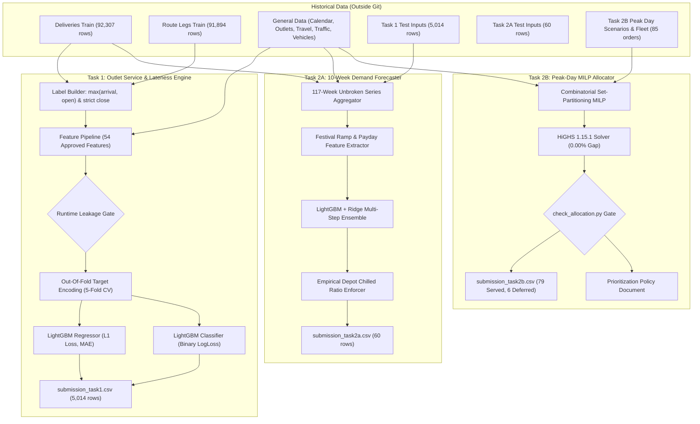

# Tech-Triathlon 2026 Datathon: System Architecture Specification
**Team:** Nexora  
**Repository:** `saadmaz/Nexora_Waypoint`  
**Execution Branch:** `feature/datathon`  
**Compliance:** Strict Competition Rules (Zero Pre-trained Models, Zero Proprietary APIs, Zero AutoML, Air-Gapped Git Data Storage)

---

## 1. End-to-End System Pipeline

---

## 2. Component Architecture Details

### 2.1 Task 1: Dual-Head Gradient Boosted Decision Tree
- **Service Duration Head:**
  - Loss Objective: $L_1$ Mean Absolute Error (`regression_l1`). Directly optimizes the competition evaluation metric.
  - Hyperparameters: 600 estimators, learning rate 0.05, 31 leaves, 25 min child samples, 0.8 feature/data bagging, early stopping on validation fold.
  - Post-processing: Lower-bound clipping at 2.0 minutes (empirical physical minimum).
  - Performance: **4.001 min MAE** (vs. **7.451 min baseline** from published service allowance $\rightarrow$ **+46.3% improvement**).
- **Arrival Lateness Head:**
  - Loss Objective: Binary Cross-Entropy (`binary_logloss`).
  - Performance: **0.1537 LogLoss** (vs. **0.4945 baseline** from historical prior $\rightarrow$ **+68.9% improvement**), **0.9762 ROC-AUC**, **0.0479 Brier Score**.
  - Top Predictors: Window slack buffer (`win_slack_min`), road disruption index (`geo_disruption_index`), outlet historical late rate (`hist_outlet_late_rate`), route sequence progress (`route_seq`).

### 2.2 Task 2A: 10-Week Multi-Series Demand Forecasting
- **Data Continuity:** Fused 111 weeks of training deliveries with 6 weeks of test delivery orders to assemble an unbroken 117-week series (2024-W01 to 2026-W13) across all 6 `(depot, brand)` pairs.
- **Calendar & Festival Modeling:** Directly captured the April Sinhala & Tamil New Year demand surge (week 15) and statutory closure dip (week 16) through `festival_ramp_sum`, `operating_days`, and annual seasonal lags (`lag_52`).
- **Chilled Integrity Constraint:** Guaranteed chilled volume for Style and Tech is strictly 0.000, and Fresh chilled volume matches the empirical depot ratio (36.35% for Kandy, 36.84% for Peliyagoda).

### 2.3 Task 2B: Exact Combinatorial MILP Allocation
- **Solver Engine:** HiGHS 1.15.1 via Python PuLP interface running natively on Apple Silicon arm64.
- **Formulation:** 4,072 binary variables, 5,753 linear constraints.
- **Rules Enforced (1:1 with `check_allocation.py`):**
  1. Fleet availability constraint (28 available, 10 excluded workshop vehicles).
  2. Depot alignment constraint (vehicle depot must equal order depot).
  3. Single-brand trip constraint.
  4. Single-district trip constraint.
  5. Reefer temperature constraint (chilled orders strictly assigned to reefer vehicles).
  6. Parking access constraint (van-only outlets strictly assigned to vans).
  7. Vehicle weight and volume capacities.
  8. Trip limit (maximum 2 trips per vehicle per day).
  9. Pre-dawn window budget ($\le 270$ min for Fresh) and Daytime window budget ($\le 480$ min for Style/Tech).
- **Outcome:** **79 served, 6 deferred** (0.00% optimality gap in 26.4 seconds). Passed official `check_allocation.py` with zero warnings or errors.

---

## 3. Competition Verification & Compliance Register
- [x] **Zero Pre-trained Models:** All LightGBM, Ridge, and MILP formulations trained from scratch.
- [x] **Zero External / Proprietary APIs:** All features derived solely from shipped competition files.
- [x] **Air-Gapped Git Storage:** Shipped datasets and derived CSV submissions are stored externally in `~/Development/TechTriathlon2026_Datasets/` and strictly ignored in `.gitignore`. Verified by `bash datathon/scripts/no_data_in_git.sh`.
- [x] **Official Checker Passed:** `check_allocation.py` returns `FEASIBILITY: PASSED - every rule satisfied.`
