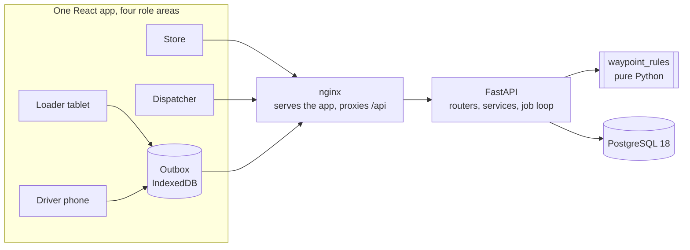
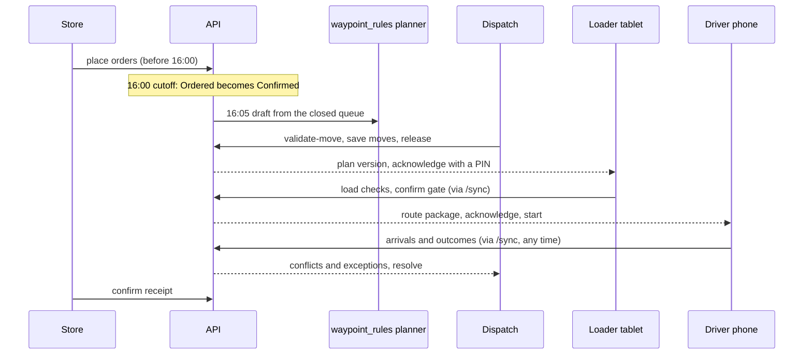

# Architecture

Waypoint takes a store's order to a confirmed delivery: **order, plan, allocate, load, deliver, confirm**. It is one repository
and one deployable system with four role apps on one database.



## The pieces

| Piece | Where | What it is |
|---|---|---|
| Frontend | `frontend/` | React, TypeScript and Vite. One app with four role areas under `src/screens/`, shared UI in `src/shared`, the offline core in `src/field`, types generated from the API in `src/api/schema.ts`. |
| API | `backend/app/` | FastAPI. Routers are thin; the work is in `services/`. Every route is under `/api/v1`, returns one error shape and checks role and scope. |
| Rules | `backend/waypoint_rules/` | Every constraint, calculation and refusal message, in pure Python with no FastAPI or SQLAlchemy imports. The API, the planner and the Datathon notebook import the same package. |
| Database | `backend/app/models`, `backend/alembic` | PostgreSQL 18, migrated by Alembic. See [data-model.md](data-model.md). |
| Seed | `backend/seed/` | Loads the reference data (the competition CSVs, or the small PRD 4c set when `data/` is empty), the accounts, the pinned orders and the scripted events. |
| Web server | `deploy/web/` | nginx serves the built app and proxies `/api` to the API, so the browser sees one origin. |
| End to end | `e2e/` | Playwright plays the judge walkthrough and the offline path against the running system. |

## Rules live in one place

The frontend never re-implements a rule. A screen shows what the API computed, or asks `POST /dispatcher/plan/validate-move`, which
returns every rule a move would break in the words a dispatcher reads. Order transitions go through `waypoint_rules.transition`, and
every state change writes an `audit_events` row in the same transaction. Two display mirrors remain on the client and are recorded as
departure DP-27.

## One clock

Scenario time is data, not a function of the wall clock. The `clock` row holds an anchor (a scenario time and the wall time it was set)
and a rate; `clock.now()` is `anchor_scenario + (wall now - anchor_wall) * rate`, and `clock.wall_now()` is the only place the backend
reads real time. Rate 1 is real time, 0 is paused, 60 is a minute a second (`CLOCK_RATE`). The demo date is `SCENARIO_SERVICE_DATE`; the
seed derives the planning day and writes every scripted time as an offset from it.

A loop in the API process (`JOB_LOOP`) runs whatever is due when the clock crosses it: the 16:00 cutoff, the 16:05 draft and the scripted
events, each once (a unique key in `job_runs`), in time order, even after a big jump. On the client, `api/serverClock.ts` asks `GET /clock`
and extrapolates between answers. It is the only frontend module that reads the wall clock for business time. The service worker never
caches the clock. See departure DP-26.

## From order to confirmed delivery



**Planning** is a deterministic function of the closed queue, the fleet and the calendar (`waypoint_rules/planner.py`). It groups by brand
and district, builds trips on the best-fitting vehicle, and defers what does not fit as *capacity* (no vehicle can carry it) or *policy*
(it would break a rule or a protected stop), each with a reason. Plan versions are immutable once released; a change makes a new version.

## Offline

The loader tablet and the driver phone write to a local outbox first (IndexedDB), then send records to `POST /sync` when they can. A record
carries a `clientId`, so sending it twice is a no-op (`duplicate`). The server answers each record `accepted`, `duplicate`, `conflict` or
`error`; a delivery recorded on a plan the phone has not seen answers `conflict`, which Dispatch resolves. The app shell and the last route
package are cached by a service worker, so a reload with no network still opens. Reconciliation rules and the walkthrough that exercises them
are in PRD sections 15 and 16, and `e2e/offline.spec.ts` cuts the browser's network to prove them.

## Mocks are development only

Each role has a mock implementation of its API interface for design work. A production build always runs on the API: `roleApiMode()` returns
`api` unless `import.meta.env.DEV`, and the mocks load only through `src/devMocks/`, behind a dynamic import inside that same check, so the
bundler drops them. CI builds and fails if any seed id, persona name or calendar date written for the mocks is in `dist/`
(`npm run check:bundle`).

## Quality gates

| Layer | What runs | Where |
|---|---|---|
| Rules and planner | pytest: every rule with a passing and a failing case, golden plans, the sync and reconciliation replay | `backend/tests/rules` |
| API | pytest against PostgreSQL 18.6: auth and scope, every role's routes, the clock and jobs, a second service date | `backend/tests/api` |
| Frontend | oxlint, `tsc -b`, vitest under two time zones, `vite build`, the bundle check | `frontend/` |
| System | `docker compose up`, then Playwright plays the walkthrough in a browser | `.github/workflows/ci.yml`, `e2e/` |

CI also checks that Alembic has exactly one head and that the database matches the models.

## Running it

```bash
docker compose up --build          # db, api (migrate + seed), web on http://localhost:8080
```

`.env.example` lists the settings. The ones that matter for a demo are `CLOCK_RATE`, `SCENARIO_SERVICE_DATE`, `SEED_ON_START` and
`SEED_GENERATED_ORDERS`.
