# Data model

PostgreSQL 18.6, migrated by Alembic (`backend/alembic`). One database holds the reference data from the
competition CSVs, the order record and every plan version, field record and audit event. Conventions:

- Dataset IDs are kept as text primary keys (`OUT084`, `VEH039`, `ORD2001`).
- Times are `timestamptz`, stored in UTC and shown in Asia/Colombo. `service_date` is the delivery day.
- Enums are stored as their value with a CHECK constraint, so adding a value needs no type migration.
- Every business action writes its state change and an `audit_events` row in one transaction.
- Allocation rules are enforced in the database as well as the engine: an order appears at most once per
  plan version (`trip_orders`), and a vehicle runs at most trips 1 and 2 per plan version (`trips`).
- Device writes are idempotent: `device_records.client_id` is the outbox UUID, so a replay is a no-op.

Solid lines are foreign keys. The one dashed line (`service_allowances` to `outlets`) is a lookup by brand and dock type.
`audit_events.entity_type` + `entity_id` is a deliberate polymorphic reference so one log covers every table;
`audit_events.order_id` is also set whenever the event concerns an order, so order history is a plain join.

Columns that end in `_by` or are called `actor` keep the display name for history. Each one has a
matching `_user_id` or `_pin_id` foreign key, so every action can be traced to an account or PIN person.
Order links are stored in join tables (`conflict_orders`, `exception_orders`, `device_record_orders`),
never as arrays, so every reference is checked by the database.

## Full ER diagram (37 tables)

This is the latest v3 relational model supplied for the database foundation. It supersedes the
older column lists in PRD §10. Nullable existing fields remain nullable unless this version requires
otherwise; execution results and actor FKs are nullable until the corresponding fact exists.
`trip_orders.outcome` defaults to `pending`. In addition to the links below, a composite FK ties
`trip_orders (trip_id, plan_version_id)` to `trips (id, plan_version_id)`, preventing a stop from claiming
another plan version to bypass the one-order-per-version rule.

```mermaid
erDiagram
    calendar_days {
        date date PK
        integer dow
        text dow_name
        boolean is_weekend
        integer iso_year
        integer iso_week
        boolean is_payday
        text festival
        float festival_ramp
        boolean is_holiday
        boolean monsoon
        boolean is_operating
    }
    depots {
        text id PK
        text name
    }
    districts {
        text name PK
        text depot_id FK "UNIQUE(name, depot_id)"
        text road_class
        float free_flow_kmh
        float depot_to_district_km
        float depot_to_district_freeflow_min
        float inter_stop_km
        float inter_stop_freeflow_min
    }
    outlets {
        text id PK
        text name
        enum brand
        text district FK
        text depot_id FK "(district, depot_id) references districts(name, depot_id)"
        enum dock_type
        text parking_constraint
        time mall_window_open
        time mall_window_close
        time window_open
        time window_close
        float units_to_kg
        float units_to_m3
    }
    service_allowances {
        enum brand PK
        enum dock_type PK
        integer minutes
    }
    traffic_speed {
        text district PK,FK
        integer hour PK
        float speed_factor
    }
    road_conditions {
        integer id PK
        date service_date FK
        text district FK
        text kind "roadworks, flooding, incident"
        float delay_factor
        text note
    }
    vehicles {
        text id PK
        enum type
        enum temp
        float weight_cap_kg
        float volume_cap_m3
        text fuel_type
        float km_per_l
        float weekly_fuel_quota_l
        text depot_id FK
    }
    drivers {
        text vehicle_id PK,FK
        text name
        integer user_id FK,UK
    }
    pin_people {
        integer id PK
        integer loader_user_id FK
        text name
        text depot_id FK
        text pin_hash
    }
    users {
        integer id PK
        text email UK
        text password_hash
        enum role
        text display_name
        text depot_id FK
        text outlet_id FK
        text vehicle_id FK
    }
    deferrals {
        integer id PK
        text order_id FK
        integer plan_version_id FK
        enum type
        enum binding
        text reason_text
        jsonb impact
        jsonb frees
        date next_run_date
        text decided_by
        integer decided_by_user_id FK
        timestamptz decided_at
        timestamptz notice_sent_at
        timestamptz notice_seen_at
        timestamptz withdrawn_at
        text withdrawn_reason
    }
    orders {
        text id PK
        text outlet_id FK
        date service_date FK
        enum temp
        integer units
        float weight_kg
        float volume_m3
        enum status
        text_array tags
        timestamptz received_at
        text placed_by
        boolean after_cutoff
        timestamptz cancelled_at
        text deferred_from_order_id FK
        integer row_version
    }
    outlet_service_history {
        text outlet_id PK,FK
        date service_date PK
        enum outcome
        time time
    }
    acknowledgements {
        integer id PK
        integer plan_version_id FK
        enum actor_kind
        integer pin_person_id FK
        text depot_id FK
        text driver_vehicle_id FK
        timestamptz acknowledged_at
    }
    fuel_ledger {
        text vehicle_id PK,FK
        integer iso_year PK
        integer iso_week PK
        float used_before_l
    }
    load_checks {
        integer id PK
        integer trip_id FK
        text order_id FK
        integer units_expected
        integer units_loaded
        integer checked_by_pin FK
        timestamptz checked_at
        uuid client_id FK,UK
    }
    load_gates {
        integer trip_id PK,FK
        timestamptz confirmed_at
        integer confirmed_by_pin FK
    }
    plan_versions {
        integer id PK
        date service_date FK
        integer number "UNIQUE(service_date, number)"
        enum state
        text note
        text created_by
        timestamptz created_at
        timestamptz released_at
    }
    trip_orders {
        integer trip_id PK,FK
        text order_id PK,FK
        integer plan_version_id FK "UNIQUE(plan_version_id, order_id)"
        integer seq
        timestamptz planned_arrival
        timestamptz planned_handling_start
        timestamptz planned_handling_end
        timestamptz actual_arrival
        timestamptz actual_handling_end
        enum outcome "pending, delivered, partial, failed"
        integer units_delivered
        uuid outcome_record_id FK
        uuid pod_attachment_id FK
    }
    trips {
        integer id PK
        integer plan_version_id FK
        text vehicle_id FK
        integer trip_no "CHECK 1 or 2; UNIQUE(plan_version_id, vehicle_id, trip_no)"
        enum brand
        text district FK
        timestamptz depart_at
        integer minutes
        float kg
        float m3
        float planned_km
        float planned_fuel_l
    }
    vehicle_day_status {
        text vehicle_id PK,FK
        date service_date PK
        enum availability
        timestamptz available_from
        timestamptz held_at
        text held_reason
        text replaced_by FK
    }
    attachments {
        uuid id PK
        uuid device_record_id FK
        enum kind
        text path
        text mime
        integer bytes
    }
    conflicts {
        integer id PK
        jsonb server_snapshot
        jsonb device_snapshot
        enum recommendation
        text_array reasons
        enum status
        text resolution
        text resolved_by
        integer resolved_by_user_id FK
        timestamptz resolved_at
    }
    device_records {
        uuid client_id PK
        text device_id
        integer user_id FK
        text actor
        enum type
        text outlet_id FK
        text vehicle_id FK
        integer trip_id FK
        jsonb payload
        timestamptz device_time
        integer plan_version_on_device
        timestamptz received_at
        enum result
        text result_reason
        integer conflict_id FK
    }
    exceptions {
        integer id PK
        enum kind "loader_shortfall, driver_problem, store_issue"
        text type
        text vehicle_id FK
        integer trip_id FK
        text detail
        text raised_by
        integer raised_by_user_id FK
        integer raised_by_pin_id FK
        timestamptz raised_at
        timestamptz device_time
        enum status
        jsonb decision
        text decided_by
        integer decided_by_user_id FK
        timestamptz decided_at
    }
    receipts {
        text order_id PK,FK
        integer units_received
        text shortfall_reason
        timestamptz confirmed_at
        text confirmed_by
    }
    runs {
        integer id PK
        integer trip_id FK,UK
        integer plan_version_seen FK
        timestamptz departed_at
        timestamptz finished_at
        float gps_km
        float gps_gap_filled_km
        float fuel_l_est
        timestamptz last_heard_at
    }
    conflict_orders {
        integer conflict_id PK,FK
        text order_id PK,FK
    }
    exception_orders {
        integer exception_id PK,FK
        text order_id PK,FK
        integer units_short
    }
    device_record_orders {
        uuid client_id PK,FK
        text order_id PK,FK
    }
    demand_forecasts {
        integer id PK
        text depot_id FK
        enum brand
        integer iso_year
        integer iso_week
        float total_volume_m3
        float chilled_volume_m3 "0 for Style and Tech"
        text model_version
        timestamptz generated_at
    }
    audit_events {
        bigint id PK
        timestamptz at
        text actor
        integer actor_user_id FK
        integer actor_pin_id FK
        text entity_type
        text entity_id
        text order_id FK
        enum type
        jsonb payload
    }
    clock {
        integer id PK
        timestamptz scenario_now
        timestamptz checkpoint
        timestamptz updated_at
    }
    notices {
        integer id PK
        enum audience_kind "store, driver, dock, dispatcher"
        text outlet_id FK
        text vehicle_id FK
        text depot_id FK
        enum tag
        text title
        text body
        jsonb link
        jsonb refs
        timestamptz created_at
    }
    notice_reads {
        integer notice_id PK,FK
        integer user_id PK,FK
        timestamptz read_at
    }
    scenario_events {
        integer id PK
        timestamptz at
        text kind
        jsonb payload
        timestamptz applied_at
    }
    depots |o--o{ acknowledgements : "depot_id"
    pin_people |o--o{ acknowledgements : "pin_person_id"
    drivers |o--o{ acknowledgements : "driver_vehicle_id"
    plan_versions ||--o{ acknowledgements : "plan_version_id"
    device_records |o--o{ attachments : "device_record_id"
    orders ||--o{ deferrals : "order_id"
    plan_versions |o--o{ deferrals : "plan_version_id"
    conflicts |o--o{ device_records : "conflict_id"
    outlets |o--o{ device_records : "outlet_id"
    users |o--o{ device_records : "user_id"
    vehicles |o--o{ device_records : "vehicle_id"
    depots ||--o{ districts : "depot_id"
    users |o--o| drivers : "user_id"
    vehicles ||--o| drivers : "vehicle_id"
    trips |o--o{ exceptions : "trip_id"
    vehicles |o--o{ exceptions : "vehicle_id"
    vehicles ||--o{ fuel_ledger : "vehicle_id"
    pin_people |o--o{ load_checks : "checked_by_pin"
    orders ||--o{ load_checks : "order_id"
    trips ||--o{ load_checks : "trip_id"
    pin_people |o--o{ load_gates : "confirmed_by_pin"
    trips ||--o| load_gates : "trip_id"
    orders |o--o{ orders : "deferred_from_order_id"
    outlets ||--o{ orders : "outlet_id"
    outlets ||--o{ outlet_service_history : "outlet_id"
    depots ||--o{ outlets : "depot_id"
    districts ||--o{ outlets : "district"
    depots ||--o{ pin_people : "depot_id"
    users |o--o{ pin_people : "loader_user_id"
    orders ||--o| receipts : "order_id"
    plan_versions |o--o{ runs : "plan_version_seen"
    trips ||--o| runs : "trip_id"
    orders ||--o{ trip_orders : "order_id"
    trips ||--o{ trip_orders : "trip_id"
    districts ||--o{ trips : "district"
    plan_versions ||--o{ trips : "plan_version_id"
    vehicles ||--o{ trips : "vehicle_id"
    depots |o--o{ users : "depot_id"
    outlets |o--o{ users : "outlet_id"
    vehicles |o--o{ users : "vehicle_id"
    vehicles |o--o{ vehicle_day_status : "replaced_by"
    vehicles ||--o{ vehicle_day_status : "vehicle_id"
    depots ||--o{ vehicles : "depot_id"
    service_allowances |o..o{ outlets : "brand + dock_type"
    outlets |o--o{ notices : "outlet_id"
    vehicles |o--o{ notices : "vehicle_id"
    depots |o--o{ notices : "depot_id"
    notices ||--o{ notice_reads : "notice_id"
    users ||--o{ notice_reads : "user_id"
    orders |o--o{ audit_events : "order_id"
    districts ||--o{ traffic_speed : "district"
    districts ||--o{ road_conditions : "district"
    calendar_days ||--o{ road_conditions : "service_date"
    device_records |o--o| load_checks : "client_id"
    conflicts ||--o{ conflict_orders : "conflict_id"
    orders ||--o{ conflict_orders : "order_id"
    exceptions ||--o{ exception_orders : "exception_id"
    orders ||--o{ exception_orders : "order_id"
    device_records ||--o{ device_record_orders : "client_id"
    orders ||--o{ device_record_orders : "order_id"
    trips |o--o{ device_records : "trip_id"
    plan_versions ||--o{ trip_orders : "plan_version_id"
    device_records |o--o{ trip_orders : "outcome_record_id"
    attachments |o--o| trip_orders : "pod_attachment_id"
    calendar_days ||--o{ orders : "service_date"
    calendar_days ||--o{ plan_versions : "service_date"
    depots ||--o{ demand_forecasts : "depot_id"
    users |o--o{ deferrals : "decided_by_user_id"
    users |o--o{ conflicts : "resolved_by_user_id"
    users |o--o{ exceptions : "raised_by_user_id"
    pin_people |o--o{ exceptions : "raised_by_pin_id"
    users |o--o{ exceptions : "decided_by_user_id"
    users |o--o{ audit_events : "actor_user_id"
    pin_people |o--o{ audit_events : "actor_pin_id"
```

## Overview for slides (no columns)

Every table and link without columns (`clock` and `scenario_events` have no links, so they are left out), for slides and the demo video. Render it with
`npx @mermaid-js/mermaid-cli -i overview.mmd -o docs/data-model-overview.svg`.

```mermaid
erDiagram
    depots |o--o{ acknowledgements : ""
    pin_people |o--o{ acknowledgements : ""
    drivers |o--o{ acknowledgements : ""
    plan_versions ||--o{ acknowledgements : ""
    device_records |o--o{ attachments : ""
    orders ||--o{ deferrals : ""
    plan_versions |o--o{ deferrals : ""
    conflicts |o--o{ device_records : ""
    outlets |o--o{ device_records : ""
    users |o--o{ device_records : ""
    vehicles |o--o{ device_records : ""
    depots ||--o{ districts : ""
    users |o--o| drivers : ""
    vehicles ||--o| drivers : ""
    trips |o--o{ exceptions : ""
    vehicles |o--o{ exceptions : ""
    vehicles ||--o{ fuel_ledger : ""
    pin_people |o--o{ load_checks : ""
    orders ||--o{ load_checks : ""
    trips ||--o{ load_checks : ""
    pin_people |o--o{ load_gates : ""
    trips ||--o| load_gates : ""
    orders |o--o{ orders : ""
    outlets ||--o{ orders : ""
    outlets ||--o{ outlet_service_history : ""
    depots ||--o{ outlets : ""
    districts ||--o{ outlets : ""
    depots ||--o{ pin_people : ""
    users |o--o{ pin_people : ""
    orders ||--o| receipts : ""
    plan_versions |o--o{ runs : ""
    trips ||--o| runs : ""
    orders ||--o{ trip_orders : ""
    trips ||--o{ trip_orders : ""
    districts ||--o{ trips : ""
    plan_versions ||--o{ trips : ""
    vehicles ||--o{ trips : ""
    depots |o--o{ users : ""
    outlets |o--o{ users : ""
    vehicles |o--o{ users : ""
    vehicles |o--o{ vehicle_day_status : ""
    vehicles ||--o{ vehicle_day_status : ""
    depots ||--o{ vehicles : ""
    service_allowances |o..o{ outlets : ""
    outlets |o--o{ notices : ""
    vehicles |o--o{ notices : ""
    depots |o--o{ notices : ""
    notices ||--o{ notice_reads : ""
    users ||--o{ notice_reads : ""
    orders |o--o{ audit_events : ""
    districts ||--o{ traffic_speed : ""
    districts ||--o{ road_conditions : ""
    calendar_days ||--o{ road_conditions : ""
    device_records |o--o| load_checks : ""
    conflicts ||--o{ conflict_orders : ""
    orders ||--o{ conflict_orders : ""
    exceptions ||--o{ exception_orders : ""
    orders ||--o{ exception_orders : ""
    device_records ||--o{ device_record_orders : ""
    orders ||--o{ device_record_orders : ""
    trips |o--o{ device_records : ""
    plan_versions ||--o{ trip_orders : ""
    device_records |o--o{ trip_orders : ""
    attachments |o--o| trip_orders : ""
    calendar_days ||--o{ orders : ""
    calendar_days ||--o{ plan_versions : ""
    depots ||--o{ demand_forecasts : ""
    users |o--o{ deferrals : ""
    users |o--o{ conflicts : ""
    users |o--o{ exceptions : ""
    pin_people |o--o{ exceptions : ""
    users |o--o{ audit_events : ""
    pin_people |o--o{ audit_events : ""
```

## Tables by area

| Area | Tables | What it holds |
|---|---|---|
| Reference data | `calendar_days`, `depots`, `districts`, `outlets`, `road_conditions`, `service_allowances`, `traffic_speed`, `vehicles` | Loaded from the competition CSVs by `seed/load_reference.py`. Read-only at run time. |
| People and access | `drivers`, `pin_people`, `users` | The four seeded accounts, the loader PIN people and the driver of each vehicle. |
| Orders and deferrals | `deferrals`, `orders`, `outlet_service_history` | One order record from the store's order to its receipt; every deferral is typed and explained. |
| Plans, trips and loading | `acknowledgements`, `demand_forecasts`, `fuel_ledger`, `load_checks`, `load_gates`, `plan_versions`, `trip_orders`, `trips`, `vehicle_day_status` | Versioned plans, their trips and stops, vehicle availability, fuel, acknowledgements, the load gate and the weekly demand forecast. |
| Field execution and reconciliation | `attachments`, `conflict_orders`, `conflicts`, `device_record_orders`, `device_records`, `exception_orders`, `exceptions`, `receipts`, `runs` | Runs, the idempotent device records from the outbox, photos, exceptions, conflicts, receipts and the order links for each. Stop outcomes are copied onto `trip_orders` when a device record is accepted. |
| Communication, audit and the scenario clock | `audit_events`, `clock`, `notice_reads`, `notices`, `scenario_events` | Notices feed every role's updates, addressed by real foreign keys and read per person; audit events are append-only history. |

## Changes in this version

| # | Change | Why |
|---|---|---|
| 1 | `trip_orders.plan_version_id` with `UNIQUE(plan_version_id, order_id)`; `trips.trip_no` CHECK 1 or 2 with `UNIQUE(plan_version_id, vehicle_id, trip_no)`; `plan_versions` `UNIQUE(service_date, number)` | The database now enforces "whole orders, one trip" and "at most two trips per vehicle per day". |
| 2 | `order_ids` arrays on `conflicts`, `exceptions`, `device_records` replaced by `conflict_orders`, `exception_orders`, `device_record_orders`; `exceptions.units_short` moved onto `exception_orders` | Every order link is a checked foreign key and can be indexed. |
| 3 | `trip_orders` gains `actual_arrival`, `actual_handling_end`, `outcome`, `units_delivered`, `outcome_record_id`, `pod_attachment_id`; `handling_start/end` renamed `planned_handling_start/end` | Stop results and proof of delivery are queryable columns instead of JSON in a device record. |
| 4 | New `demand_forecasts` (depot, brand, ISO week, total and chilled m³) | Backs the dispatcher Forecast screen. |
| 5 | Dropped `conflicts.device_record_ids` (kept `device_records.conflict_id`); `device_records.trip_no` → `trip_id` FK; `load_checks.client_id` is now a FK; dropped `runs.driver_id` and `runs.vehicle_id` (both come from the trip), one run per trip; `drivers.user_id` unique; `acknowledgements.actor_id` split into `pin_person_id` and `driver_vehicle_id` FKs; `dock` columns renamed `depot_id` | Removes duplicate and ambiguous keys. |
| 6 | `orders.service_date` and `plan_versions.service_date` reference `calendar_days`; `outlet_service_history.time` is a `time`; `*_user_id` / `*_pin_id` FKs added next to `actor`, `decided_by`, `raised_by`, `resolved_by`; `exceptions.kind` lists `store_issue` | Plans can't target a missing calendar day, and every action traces to an account. |
| 7 | `notices.audience` text replaced by `audience_kind` plus `outlet_id`, `vehicle_id`, `depot_id` FKs; new `notice_reads` (one row per reader) | Notices go to real records and each loader or driver has their own read state. |
| 8 | `traffic_speed` stored as district × hour rows instead of raw JSON; new `road_conditions` (date, district, disruption, delay) | Matches the competition CSVs and lets ETAs account for monsoon and roadworks. |
| 9 | `districts` `UNIQUE(name, depot_id)` and `outlets (district, depot_id)` composite FK | An outlet's depot can no longer disagree with its district's depot. |
| 10 | `audit_events.order_id` FK; one dashed line left; overview diagram without columns | Order history is a join, and the slides get a readable picture. |
